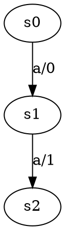

# Java-LSharp
This Java project contains an implementation of the L# algorithm.
The main code for this algorithm can be found in [this](https://gitlab.science.ru.nl/sws/lsharp) GitHub repository, which is written in the Rust programming language.

## Requirements
Ensure your machine supports Java 21 or higher. You can verify the installation by executing the following command:

```bash
java -version
```
## Running Instructions
The experiment files, which are taken from the Rust project, are located in folder `src/main/resources/experimentModels`.
If you want to create your own custom file, simply create a file named `custom.dot`
(replace "custom" with your preferred name) and place it in the above folder.
Your `custom.dot` file format should be as follows:


Ensure that your custom Mealy machine is complete and includes a transition for every input symbol.
Additionally, the first line of your `custom.dot` file should represent one of the initial state's transition (similar to `s0` in the example above!).

To run the algorithm on your own `custom.dot` file, just run the following command:
```bash
./gradlew run --args="-f=custom.dot -eq=perfect -r2=ads -r3=ads"
```
* Use `gladlew.bat` script file if you are a Windows user.
* Set `-f` value to your experiment model file name.
* Set `-eq` value to your preferred test oracle type. It must be one of the following values: `perfect`(default), `rand_walk`, or `rand_words`.
* Set `-r2` value to your preferred rule 2 policy. It must be one of the following values: `nothing`, `sep_seq` or `ads`(default).
* Set `-r3` value to your preferred rule 3 policy. It must be one of the following values: `sep_seq` or `ads`(default).
* If you want to place your `custom.dot` file in your own folder, just set the `-fo` argument value to your folder path. The default folder path is `src/main/resources/experimentModels`.
